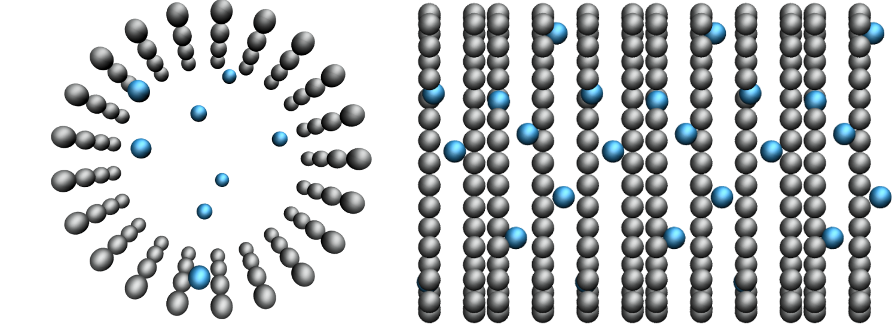

## Adsorption combined with diffusion create pink noise in nanopore

### Description

The simulation consists of particles diffusing inside a cylindrical nanopore. The surface of the nanopore is covered with adsorbing sites, and the particles reversibly adsorb at the inner surface of the nanopore. The adsorption/desorption processes are modelled using bond/create and bond/break commands respectively. A bond forms if a particle comes close enough to a trap. An additional harmonic potential is added to trapped particles. The wall of the cylinder is modelled using the wall/region command.

### How to

Run the input.lammps script using LAMMPS. If you are new to LAMMPS and VMD, you can find [tutorials and instructions here](https://lammpstutorials.github.io/).
 
### Output

This [video](https://youtu.be/lIL5v0_ObnU) has been made with this script.

### See also

Feel free to contact me by email if you have inquiries. You can find contact details on my [personal page](https://simongravelle.github.io/).

### Citation

If you use this script, please cite [Gravelle, Netz, Bocquet, Adsorption Kinetics in Open Nanopores as a Source of Low-Frequency Noise, Nano Lett. 2019, 19, 10, 7265–7272](https://doi.org/10.1021/acs.nanolett.9b02858)
